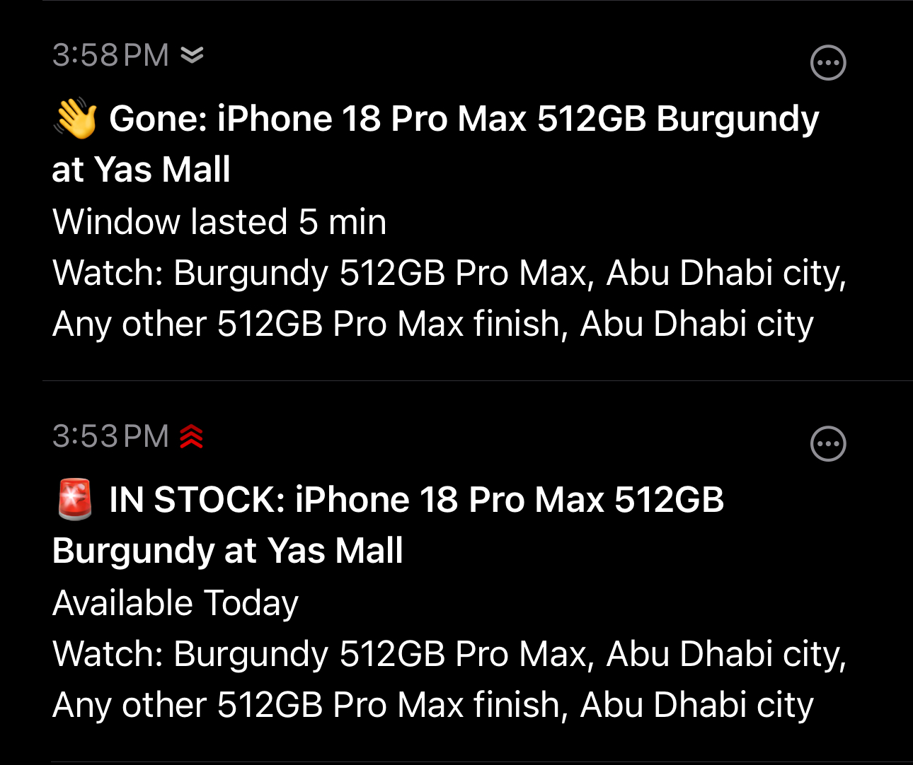
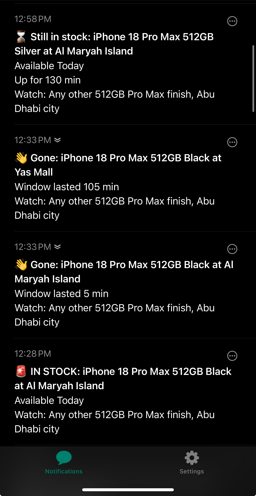

# Apple iPhone Stock Watcher (UAE)

## What this does

Every few minutes, a small Python program polls Apple UAE's store-pickup
availability endpoint for the iPhone(s) you specify and pushes an
[ntfy](https://ntfy.sh) notification to your phone the moment one becomes
collectable at a watched store. There is no UI and no automated purchasing:
the notification links straight to Apple's own buy page, and you take it
from there by hand.

It runs in two places at once, on purpose:

- **A local scheduled task, every 2 minutes.** This is the one that
  actually catches things. See [Polling cadence](#polling-cadence-why-the-local-runner-is-the-primary-one).
- **A GitHub Actions cron, as a safety net** for when your machine is off.

New here? Start at [Setup, step by step](#setup-step-by-step).

## Does it actually work?

Yes, and the margin is thinner than you would guess.



**That window was five minutes wide.** Burgundy 512GB appeared at Yas Mall
at 3:53 PM and was gone by 3:58 PM. The local runner caught it on its very
next poll. The GitHub Actions cron, which in practice fires every three to
four hours, would have missed it with better than 95% probability.

Note the two priority tiers in action: the in-stock alert carries the red
siren and the urgent chevrons, because burgundy is the finish this
particular config actually wants. The routine traffic below looks different:



Two things worth reading off that timeline. Windows vary enormously: the
same finish lasted 5 minutes at one store and 105 minutes at another on the
same afternoon. And the `Gone` and `Still in stock` messages are not noise,
they are how you tell "I missed it" from "it is still sitting there",
without opening Apple's site to check.

## Setup, step by step

Written for someone who has not used this kind of tool before. Nine steps,
about fifteen minutes. Commands are Windows PowerShell; notes for macOS and
Linux are inline. You do not need to understand the code to run it.

### What you need first

- **Python 3.11 or newer.** Check with `python --version`. If that errors or
  shows an older version, install it from [python.org](https://python.org)
  and tick **"Add Python to PATH"** during setup.
- **Git.** Check with `git --version`, or install from
  [git-scm.com](https://git-scm.com).
- An **iPhone or Android phone** for the alerts.
- A **GitHub account**, only if you want the optional cloud safety net in
  step 8.

### Step 1: Get the code

```powershell
git clone https://github.com/7mxd/apple-iPhone-stock-watcher.git
cd apple-iPhone-stock-watcher
```

### Step 2: Install it

```powershell
pip install -e .
```

The `-e` means the install points at this folder, so editing `watches.yml`
later takes effect immediately with nothing to reinstall.

Verify it worked:

```powershell
python -m applewatch --dry-run
```

You should see a line like `watching 4 SKU(s) across 8 store pair(s)`.
`--dry-run` never sends anything, so it is always safe to run.

### Step 3: Choose your secret topic name

ntfy delivers notifications to a "topic", which is just a name you invent.
**Anyone who knows the name can read your notifications**, so the name is
the only thing protecting them. Do not use something guessable like
`iphone-alerts`.

Make it long and random, for example:

```
apple-stock-a7f3k9-q2xw8m
```

Write it down. You will paste it in three places below, and it must match
exactly every time, including spelling and hyphens.

### Step 4: Set up your phone

1. Install **ntfy** from the App Store or Google Play.
2. Open it, tap **+**, choose **Subscribe to topic**.
3. Type your topic name from step 3. Leave the server as `ntfy.sh`.
4. Allow notifications when prompted.

**On iPhone, do these two as well.** Skipping them is the single most common
way to end up with a watcher that works perfectly and still never wakes you:

- **Settings → Notifications → ntfy → enable Time Sensitive Notifications.**
- **Settings → Focus → Sleep → Apps → add ntfy.** Restocks happen at all
  hours. Without this, a 3am alert waits politely until morning, by which
  point the phone is gone.

### Step 5: Tell the program your topic

```powershell
setx NTFY_TOPIC "your-topic-from-step-3"
```

Then **close and reopen your terminal**, because `setx` only affects new
sessions.

On macOS or Linux, add `export NTFY_TOPIC="your-topic-from-step-3"` to your
`~/.zshrc` or `~/.bashrc` instead.

This keeps the topic out of the repository, which is public.

### Step 6: Prove the alerts actually reach you

**Do not skip this.** ntfy creates a topic automatically the first time
anything posts to one, so a misspelled topic still returns success. Every
run will look healthy and you will simply never be told anything. This is
the only step that catches that.

```powershell
python -m applewatch --force-notify
```

Your phone should buzz within a few seconds with a test alert. If nothing
arrives, the topic in step 5 does not match the one in step 4. Fix that
before going further; nothing else in this list matters until this works.

### Step 7: Say what you want to watch

Open `watches.yml` in any text editor. Out of the box it watches every
512GB iPhone 18 Pro Max finish at the two Abu Dhabi city stores, with
burgundy at a louder priority than the rest.

To change it, see [Configuring watches](#configuring-watches). Then always
check your edit before relying on it:

```powershell
python -m applewatch --dry-run
```

This prints exactly which phones and which stores your rules resolve to, so
you never have to guess whether a rule means what you think it means. A
typo raises a clear error rather than silently watching nothing.

### Step 8: Start the local watcher (the important one)

This is what polls every couple of minutes and what will actually catch a
restock.

```powershell
powershell -ExecutionPolicy Bypass -File scripts\register_local_task.ps1
```

That registers a Windows scheduled task named `AppleStockWatcher`, polling
every two minutes. Confirm it is alive:

```powershell
Get-ScheduledTaskInfo -TaskName AppleStockWatcher
```

`LastTaskResult: 0` means the last run succeeded.

On macOS or Linux there is no equivalent script; add a cron entry instead:

```
*/2 * * * * cd /path/to/apple-iPhone-stock-watcher && /usr/bin/python3 -m applewatch
```

### Step 9 (optional): The cloud safety net

The local task only runs while your computer is on. GitHub Actions covers
the rest, slowly. Fork this repo, then:

```powershell
gh secret set NTFY_TOPIC --body "your-topic-from-step-3"
```

Or in the GitHub UI: **Settings → Secrets and variables → Actions → New
repository secret**. Then enable Actions on your fork; the Actions tab
prompts you the first time.

Be clear about what this gives you: a poll every three to four hours, not
every five minutes. See
[Polling cadence](#polling-cadence-why-the-local-runner-is-the-primary-one)
for why, and why it is a backstop rather than the main event.

### You are done

Leave it running. When a watched phone appears, your phone buzzes with the
store name and Apple's own pickup wording, and tapping the alert opens the
buy page.

Stop it at any time with:

```powershell
Unregister-ScheduledTask -TaskName AppleStockWatcher -Confirm:$false
```

## Configuring watches

`watches.yml` has three optional top-level settings and one required list:

| Key | Default | Meaning |
|---|---|---|
| `ntfy_topic_env` | `NTFY_TOPIC` | Name of the environment variable holding the ntfy topic. You will not normally need to change this. |
| `poll_location` | `Abu Dhabi` | The `location` string sent to Apple's endpoint, the same field the store-locator search box takes. With only five stores in the whole country, it does not filter which stores come back in the response; `stores`/`cities`/`emirates` on each watch do that filtering locally, after the fetch. |
| `reminder_minutes` | `30` | How often, in minutes, a "still in stock" reminder repeats while a watched pair stays available. See [How alerts behave](#how-alerts-behave). |
| `watches` | *(none)* | The list of watch rules below. At least one is required. |

Each entry under `watches` is one rule:

| Field | Type | Omitted means | Matches against |
|---|---|---|---|
| `name` | string | required | label shown in notifications |
| `model` | string | any model | `iphone18pro`, `iphone18promax` |
| `capacity` | list | any capacity | `256gb`, `512gb`, `1tb`, `2tb` |
| `color` | list | any colour | `burgundy`, `black`, `silver`, `glacier` |
| `stores` | list | see below | store number or exact name |
| `cities` | list | see below | `Abu Dhabi`, `Dubai`, `Al Ain` |
| `emirates` | list | see below | `Abu Dhabi`, `Dubai` |
| `priority` | enum | `urgent` | `urgent`, `high`, `default`, `low` |

There is deliberately no `screen` field. `model` already implies screen
size (`iphone18pro` is 6.3", `iphone18promax` is 6.9"), so a separate
`screen` filter would only ever be redundant with `model` or silently
contradict it. Config loading rejects a `screen` key outright rather than
accept it and ignore it.

Every value is validated against the live catalog and the store list at
startup. A typo (`burgandy` instead of `burgundy`) is a hard config error
that stops the run, not a rule that silently matches nothing, because a
watch that matches nothing and a watch that matches something with no
current stock look identical from the outside.

### The five UAE stores

| Number | Name | City | Emirate |
|---|---|---|---|
| R706 | Al Maryah Island | Abu Dhabi | Abu Dhabi |
| R595 | Yas Mall | Abu Dhabi | Abu Dhabi |
| R596 | Mall of the Emirates | Dubai | Dubai |
| R597 | Dubai Mall | Dubai | Dubai |
| R785 | Al Jimi Mall | Al Ain | Abu Dhabi |

### Matching rules

- Fields **AND** together: a watch with both `model` and `capacity` set
  requires both to match.
- Values within one field **OR** together: `capacity: [512gb, 1tb]` matches
  either.
- An omitted field is a wildcard: no `color` means every colour.
- `stores`, `cities` and `emirates` are three ways of selecting the same
  thing (which stores this watch applies to) and are **mutually
  exclusive**. Setting more than one on the same watch is a config error at
  startup, not a union or an intersection. Set at most one; omitting all
  three watches every store.

### The Al Jimi worked example

This is the one detail in this file that will cost you real driving
distance if you skim past it. Apple's own data files **Al Jimi Mall (R785)**
under the city **"Al Ain"**, even though the mall itself sits inside the
**Abu Dhabi emirate**. `city` and `emirate` are not the same axis, and
Apple's `city` string is the one that gets compared literally, so the two
selectors genuinely disagree here:

- `cities: [Abu Dhabi]` -> **R706 Al Maryah Island** and **R595 Yas Mall**
  only. Al Jimi Mall is filed under the city Al Ain, so a city filter for
  "Abu Dhabi" silently excludes it.
- `emirates: [Abu Dhabi]` -> the same two stores, **plus R785 Al Jimi
  Mall**, because `emirate` is the field this repository maintains
  specifically to capture that Al Jimi Mall is administratively in Abu
  Dhabi despite Apple's city label. (Apple's payload sends an empty
  `state` field for every UAE store, so `emirate` cannot be read from
  Apple at all; it is hand-maintained in `stores.yml`.)

Choose deliberately, not by habit. Al Jimi Mall is roughly 133 km from
central Abu Dhabi, farther than Dubai Mall is. If you only ever wanted the
two Abu Dhabi city stores, `emirates: [Abu Dhabi]` will alert you to a
pickup that is not the convenient one you expected. If you were relying on
"Abu Dhabi" to also cover Al Jimi, `cities: [Abu Dhabi]` will quietly never
alert you to it at all, and nothing about that failure is visible unless
you already know this paragraph.

### Four recipes

**The strict default:** one exact phone, one city.

```yaml
ntfy_topic_env: NTFY_TOPIC
poll_location: Abu Dhabi
reminder_minutes: 30

watches:
  - name: "Burgundy 512GB Pro Max, Abu Dhabi city"
    model: iphone18promax
    capacity: [512gb]
    color: [burgundy]
    cities: [Abu Dhabi]
    priority: urgent
```

**Any colour, one store:** drop `color` entirely rather than list every
colour; an omitted field is already a wildcard.

```yaml
ntfy_topic_env: NTFY_TOPIC
poll_location: Abu Dhabi
reminder_minutes: 30

watches:
  - name: "Any colour 256GB Pro, Dubai Mall"
    model: iphone18pro
    capacity: [256gb]
    stores: [R597]
    priority: high
```

**A whole emirate**, including Al Jimi Mall:

```yaml
ntfy_topic_env: NTFY_TOPIC
poll_location: Abu Dhabi
reminder_minutes: 30

watches:
  - name: "Any Pro Max, Abu Dhabi emirate (incl. Al Jimi Mall)"
    model: iphone18promax
    emirates: [Abu Dhabi]
    priority: urgent
```

**Every 512GB, nationwide:** omit `model`, `color` and every location
selector; only `capacity` constrains it.

```yaml
ntfy_topic_env: NTFY_TOPIC
poll_location: Abu Dhabi
reminder_minutes: 30

watches:
  - name: "Every 512GB, nationwide"
    capacity: [512gb]
    priority: default
```

## Validating a change

```bash
pip install -e .          # once, to make `python -m applewatch` importable
python -m applewatch --dry-run
```

`--dry-run` fetches live availability, resolves every watch to its SKUs and
store pairs, prints how many of each it is watching, prints any alert it
would have sent (`[would send] <title>` followed by the body), and then
exits, **without sending anything to ntfy and without writing `state.json`**.
Run it after any `watches.yml` edit, before committing:

```
watching 1 SKU(s) across 2 store pair(s)
no changes
```

`--dry-run` and `--force-notify` are mutually exclusive: `--dry-run`
promises nothing is sent, `--force-notify` exists only to send something
real, so combining them is refused rather than silently picking one. That
combination, and any other configuration problem, exits with status `2`.

Exit codes, for scripting or for reading a failed Actions run:

| Code | Meaning |
|---|---|
| `0` | Ran to completion, whether or not anything changed. |
| `1` | The request to Apple failed outright, or Apple's response stopped reporting one or more watched pairs, partial miss or total (see [Troubleshooting](#troubleshooting)). Also used if a real ntfy delivery fails mid-run. |
| `2` | Configuration error, `NTFY_TOPIC` not set, no watch matched any SKU or store, or `--dry-run` combined with `--force-notify`. |

## ntfy setup

1. Install [ntfy](https://apps.apple.com/app/ntfy/id1625396347) from the
   App Store.
2. Choose an unguessable topic, for example `apple-ae-burgundy-k7f2q9x`.
   Topics on `ntfy.sh` are just URL paths: anyone who knows (or guesses) the
   name can read and post to it, so a long random suffix is the only thing
   protecting yours.
3. In the app, **+ -> Subscribe to topic**, enter the name, and leave the
   server as `ntfy.sh`.
4. Allow notifications when iOS asks.
5. In **Settings -> Notifications -> ntfy**, enable **Time Sensitive
   Notifications**.
6. Add ntfy to the allowed apps for your sleep Focus (**Settings -> Focus
   -> Sleep -> Apps**). Do both 5 and 6: iOS Focus modes silence everything
   by default except apps you explicitly allow, and a restock at 4am is
   exactly when this project is supposed to work. Skip either step and a
   4am alert gets suppressed by the phone before you ever see it, which
   defeats the entire point of running this.
7. Set the secret on your fork:
   ```bash
   gh secret set NTFY_TOPIC --body "<topic>"
   ```
8. Verify delivery end to end:
   ```bash
   curl -d "test" ntfy.sh/<topic>
   ```
   You should feel your phone buzz within a few seconds.

## How alerts behave

State persists across runs in `state.json` (committed back to the repo by
the workflow), so alerts fire on *transitions*, not on every poll that
happens to see stock:

- **Flips to in stock:** fires once, at the watch's own `priority` (default
  `urgent`; if more than one watch covers the same pair, the highest of
  their priorities is used).
- **Still in stock:** a quieter reminder repeats every `reminder_minutes`
  (default 30) for as long as it stays available, always at `default`
  priority regardless of the watch's own setting. The reminder body reports
  total time in stock so far, not time since the last reminder.
- **Goes out of stock again:** fires once, at `low` priority, reporting how
  long the window lasted.

Tapping any of these opens the phone's page on `apple.com/ae`.

## Polling cadence: why the local runner is the primary one

This project began as GitHub Actions only. That did not survive contact
with reality, and the change is worth explaining because the original
design looks perfectly reasonable on paper.

**The plan.** `.github/workflows/check.yml` asks for `*/5 * * * *`, a poll
every five minutes, free and with no dependency on any machine of yours
being switched on.

**What actually happened.** Measured on this repo over seven hours:
**three runs, an average gap of 3 hours 42 minutes, about 3% of the rate
configured.** GitHub queues scheduled workflows on a best-effort basis and
deprioritises them heavily, and the `[skip ci]` state commits do not count
as the kind of repository activity that would help.

**Why that is fatal here rather than merely annoying.** Restock windows are
short. Observed on a single afternoon:

| Phone | Store | Window |
|---|---|---|
| Burgundy 512GB | Yas Mall | **5 minutes** |
| Black 512GB | Al Maryah Island | 5 minutes |
| Black 512GB | Yas Mall | 105 minutes |
| Silver 512GB | Al Maryah Island | 130 minutes and counting |

A three-to-four-hour polling gap against a five-minute window is not a
degraded service, it is a coin flip you lose almost every time. The
burgundy alert at the top of this README was caught by the local runner on
its next poll. The cloud cron would have missed it outright.

**The fix.** `scripts/local_check.ps1` runs the same checker locally on a
short interval while your machine is awake, and became the primary poller.
The Actions cron stays enabled as a genuine safety net for hours when the
machine is off, where a slow check still beats no check. Registration is
covered in [step 8](#step-8-start-the-local-watcher-the-important-one):

```powershell
powershell -ExecutionPolicy Bypass -File scripts\register_local_task.ps1
# optional: -IntervalMinutes 2
```

Useful afterwards:

```powershell
Get-ScheduledTaskInfo -TaskName AppleStockWatcher   # last result, next run
Get-Content "$env:TEMP\applewatch-local.log" -Tail 20
Start-ScheduledTask   -TaskName AppleStockWatcher   # run immediately
Unregister-ScheduledTask -TaskName AppleStockWatcher -Confirm:$false
```

Both runners share `state.json` through git, so whichever sees a
transition first records it and the other stays quiet. The local script
treats every git step as best-effort and only the check itself as
load-bearing, so a sync failure degrades to a possible duplicate alert,
never a missed one.

The task runs only while you are logged on (a locked session counts).
Running it otherwise would require storing your account password with the
task, which is not worth it for a fast lane that the cloud cron already
backstops.

## Troubleshooting

| Symptom | Cause | Fix |
|---|---|---|
| No alerts ever arrive, even when you know stock changed | iOS Focus is silencing ntfy | Check the Time Sensitive and sleep-Focus allowlist steps above, then confirm the pipe still works with `python -m applewatch --force-notify` (sends one real alert for the first watched pair and exits). |
| Run refuses to start with `config error:` followed by `unknown color [...]` (or `model`/`store`/`city`/`emirate`/`priority`) | Typo in `watches.yml` | Every valid value is enumerated in the field table above; compare byte-for-byte, including case. |
| `apple request failed: Apple did not report N of M watched pair(s)...` and exit code `1` | Apple rotated one or more part numbers, or otherwise stopped reporting a watched pair. Any missing pair, partial or total, is what a rotated part number or a broken response shape looks like, not what "nobody has stock" looks like, so this is always treated as a broken checker, never as a quiet, permanent absence of stock | Run `python scripts/refresh_catalog.py` to regenerate `catalog.json`, `git diff catalog.json` to see what changed, then `--dry-run` to confirm the watch resolves to the new SKU. Note that state keys are part-number based, so if a pair was already in stock under the old part number, it will re-alert once after the rotation: the new part number starts with no history of its own. |
| The scheduled workflow stopped running | GitHub disables a repository's scheduled workflows after 60 days with no commits | Re-enable it from the Actions tab, or push any commit. |
| `ntfy POST failed (<SomeExceptionType>)` with no further detail, in stdout/stderr/Actions logs | Deliberate: ntfy failures are reported by exception type only, never by message. The underlying `requests` error embeds the full `https://ntfy.sh/<topic>` URL in its text, and this repository's Actions logs are public, so letting that string reach a log would leak the one secret this project has. | Don't go looking for more detail in the logs, there isn't any, by design. Confirm the topic still exists with `curl -d "test" ntfy.sh/<topic>`, and confirm `NTFY_TOPIC` is still set as a secret. |

A repeat "stock checker is broken" health alert (for the missing-pair row
above, or for any other unexpected failure inside a run) is itself
rate-limited to once per 6 hours, so an extended outage sends one push, not
one per poll.

## How it works

One `GET` to `https://www.apple.com/ae/shop/retail/pickup-message` returns
every UAE store's availability for the requested part numbers in a single
response, so store filtering is entirely a local concern; there is no
per-store request. A store counts as in stock when its `pickupDisplay`
value is anything other than `unavailable` or `ineligible`, a denylist
rather than a check for a known positive string.

That choice was made when the positive value had never been observed, so
hard-coding a guess risked a watcher that silently never fired. It has
since been seen in the wild: `pickupDisplay: "available"`, quoted as
`"Available Today"`. The guess would have been right, and the denylist is
being kept anyway, because it costs nothing and it is the reason the
project never depended on being right. See
[design spec 3.4](docs/superpowers/specs/2026-09-21-apple-iphone-stock-watcher-design.md#34-observed-pickupdisplay-states-and-why-the-match-rule-is-a-denylist).

## Scope

This reads a public availability endpoint, the same one Apple's own buy
page calls when you check pickup, at roughly the rate a person manually
refreshing that page every few minutes would produce. It does not log in,
does not touch a cart, and does not automate purchasing in any way: the
notification's tap target is Apple's own buy page, and everything from
there on is you, by hand.
